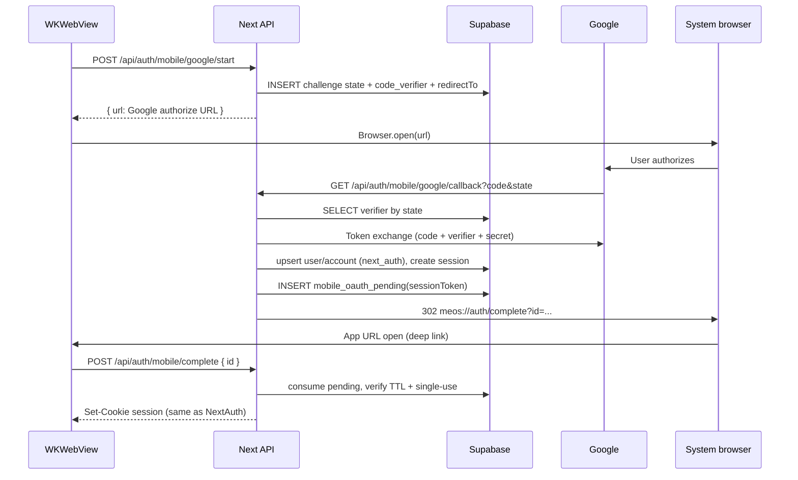

# Capacitor: system-browser OAuth with PKCE + state — implementation plan

**Plan date:** 2026-03-24  
**Tracking:** https://github.com/stephencweiss/me-os/issues/98  
**Problem:** Auth.js stores OAuth `state` and PKCE `code_verifier` in **httpOnly cookies** during the Google redirect. **WKWebView** often does not return those cookies after `accounts.google.com` → app, so both `pkceCodeVerifier` and `state` checks fail.  
**Goal:** Run the **authorization redirect in the system browser** (`ASWebAuthenticationSession` / **SFSafariViewController** / **Chrome Custom Tabs** via `@capacitor/browser`), while keeping **PKCE + state** by storing verifier/state **server-side** (not in the WebView cookie jar). Hand off a **short-lived, one-time server record** back into the WebView to set the normal **NextAuth session cookie**.

**Why your worktree still saw `state` errors:** `main` has `checks: ["none"]` in `web/lib/auth.config.ts`. If `capacitor-ios` was not rebased onto latest `main`, or dev server used a stale `.next`, you would still run **`checks: ["state"]`** or cached bundles. After this project ships, **web** sign-in keeps **`checks: ["pkce", "state"]`**; **native** uses only the **mobile** routes (no Auth.js OAuth cookies for that hop).

---

## Architecture (high level)

---

## Security properties

| Control | How |
|--------|-----|
| **PKCE** | `code_verifier` only on server; Google gets `code_challenge` (S256). |
| **CSRF `state`** | Random `state` stored with verifier; callback validates exact match. |
| **Confidential client** | Token exchange uses `client_secret` on server. |
| **Handoff** | Opaque UUID in deep link; **single-use** row; **~2 min TTL**; row deleted on consume. |
| **Replay** | Second `POST /complete` with same id → 410 / 404. |

**Threats reduced vs `checks: ["none"]`:** OAuth CSRF on the Google round trip; no reliance on WKWebView for OAuth cookies.

**Remaining:** Deep link `id` could be stolen if OS clipboard / shoulder surf — mitigate with **very short TTL** and **single tab**; optional future: encrypt `id` in fragment only (still not perfect).

---

## Prerequisites

1. **Capacitor** in `web/` (from `sw-capacitor-ios-phase1` or equivalent): `@capacitor/core`, `@capacitor/app`, `@capacitor/browser`.  
2. **iOS URL scheme** (e.g. `meos`) registered in native project + `Info.plist` / Capacitor config so `meos://auth/complete` opens the app.  
3. **Google Cloud Console** — add **Authorized redirect URI**:  
   `{AUTH_URL}/api/auth/mobile/google/callback`  
   (e.g. `http://localhost:3000/...` for dev, `https://your.domain/...` for prod).  
4. **`AUTH_URL` / `NEXTAUTH_URL`** must match the origin used in `redirect_uri` for the mobile flow (same as existing NextAuth).  
5. New env (optional overrides):  
   - `MOBILE_OAUTH_REDIRECT_SCHEME` default `meos`  
   - `MOBILE_OAUTH_HOST` default `auth` path segment → `meos://auth/complete`

---

## Database

**New migration** (public schema, **no RLS for anon** — only **service role** from API):

1. **`public.mobile_oauth_challenges`**  
   - `state` `text` **PRIMARY KEY**  
   - `code_verifier` `text` NOT NULL  
   - `redirect_to` `text` NULL (post-login path for WebView)  
   - `expires_at` `timestamptz` NOT NULL  
   - Index on `expires_at` for cleanup (optional cron or delete on read)

2. **`public.mobile_oauth_pending`**  
   - `id` `uuid` PRIMARY KEY DEFAULT `gen_random_uuid()`  
   - `session_token` `text` NOT NULL (value stored in `next_auth.sessions.sessionToken`)  
   - `expires_at` `timestamptz` NOT NULL  
   - `consumed_at` `timestamptz` NULL (set when complete succeeds)

**Cleanup:** On each `start`, opportunistically delete `expires_at < now()` for both tables (or rely on periodic job).

**Grants:** `service_role` only (matches other server-only tables); no policies for `anon`/`authenticated`.

Regenerate `web/lib/database.types.ts` after migration.

---

## Server modules

| Module | Responsibility |
|--------|----------------|
| `web/lib/mobile-google-oauth.ts` | Build Google authorize URL (PKCE S256), token exchange via `google-auth-library` or `oauth4webapi`, map profile → user fields. |
| `web/lib/mobile-oauth-db.ts` | Supabase service-role CRUD for `mobile_oauth_*` tables (or inline in routes if tiny). |
| `web/lib/mobile-session-handoff.ts` | After Google success: **ensure** `next_auth.users` + `next_auth.accounts` (mirror adapter fields), **create** `next_auth.sessions` row, return **sessionToken** string for cookie. Reuse patterns from `@auth/supabase-adapter` field names. |

**Session strategies:**

- **Database sessions** (`isSupabaseConfigured`): insert `next_auth.sessions` with `sessionToken`, `userId`, `expires`. Set cookie **name/options** to match Auth.js defaults (`authjs.session-token`, `sameSite`, `secure`, `httpOnly`, `path: /`) — derive `useSecureCookies` from `AUTH_URL`/`NEXTAUTH_URL` like `@auth/core` cookie util.  
- **JWT sessions** (local dev without adapter): implement **phase 2** or document **unsupported** until Supabase enabled — plan recommends **gating** mobile system-browser flow behind `isSupabaseConfigured` with clear 501 + message to avoid silent breakage.

---

## API routes

1. **`POST /api/auth/mobile/google/start`**  
   - Body: `{ callbackUrl?: string }`  
   - Auth: none  
   - Generate `state`, `code_verifier`, `code_challenge`  
   - Insert challenge row  
   - Return JSON `{ url }` where `url` is Google OIDC authorize URL with `client_id`, `redirect_uri`, `scope`, `state`, `code_challenge`, `code_challenge_method=S256`, `response_type=code`, `access_type=offline`, `prompt=consent` (match existing `auth.config` Google params)

2. **`GET /api/auth/mobile/google/callback`**  
   - Query: `code`, `state`, errors from Google  
   - Load challenge by `state`; verify not expired; delete challenge row (or mark used)  
   - Exchange code + verifier + redirect_uri  
   - Upsert user + Google account + create session via `mobile-session-handoff`  
   - Insert `mobile_oauth_pending`  
   - `NextResponse.redirect(`${scheme}://${hostSegment}/complete?id=${uuid}`)`  
   - **Close browser:** `@capacitor/browser` `close()` is called from app when `appUrlOpen` fires (document in client code); callback page may also show “You can close this tab” fallback for Safari.

3. **`POST /api/auth/mobile/complete`**  
   - Body: `{ id: string }`  
   - Load pending row; verify TTL; **transaction:** set `consumed_at` or delete; build `Set-Cookie` for session token matching NextAuth database session  
   - Return `{ ok: true }` or redirect to `callbackUrl` if we stored it on challenge (optional: pass through pending row)

**Rate limiting:** optional future; not in v1.

---

## Client (Capacitor)

1. **Detect native:** `Capacitor.isNativePlatform()` from `@capacitor/core`.  
2. **Login UI:** small client wrapper or branch in `login/page.tsx`:  
   - **Web:** existing server action `signIn("google", …)` (cookies + Auth.js OAuth).  
   - **Native:** client `fetch("/api/auth/mobile/google/start", { method: "POST", … })` → `Browser.open({ url })` from `@capacitor/browser`.  
3. **`App.addListener("appUrlOpen", …)`** in a **client provider** mounted from `app/layout.tsx` (only when Capacitor): parse `meos://auth/complete?id=…` (or universal link equivalent), `POST /api/auth/mobile/complete`, then `Browser.close()`, `window.location.href = callbackUrl || "/"`.

**Dev note:** iOS Simulator + `localhost` for `AUTH_URL` is OK for Google redirect; deep link must be registered on the **native** app.

---

## Auth config changes

- Restore Google provider **`checks: ["pkce", "state"]`** for the **default** NextAuth Google OAuth used by **web** `signIn`.  
- Remove or narrow `checks: ["none"]` comment — mobile flow **does not** use this provider path for OAuth cookies.

---

## Testing strategy

- **Unit:** PKCE challenge length / S256; state uniqueness; pending consume idempotency.  
- **Integration (mocked Google):** start → callback handler with mocked token response (or recorded fixtures).  
- **Manual:** Simulator: web login still works; native path opens Safari/ASWebAuth, returns to app, session visible in WebView (`/api/auth/session` or page load).  
- **Agent pressure-test:** second pass on CSRF, redirect URI allowlist, TTL, JWT-vs-database gating, Google Console steps.

---

## Rollout checklist

- [ ] Migration applied (`pnpm run db:push` or project standard).  
- [ ] Types regenerated.  
- [ ] Google redirect URI added.  
- [ ] iOS URL scheme verified.  
- [ ] `AUTH_URL` matches deployed origin.  
- [ ] Rebase `capacitor-ios` worktree onto `main` after merge.

---

## Agent review (pressure test) — integrated requirements

- **`redirect_to` / post-login paths:** allowlist **same-origin relative paths only** (must start with `/`, reject `//`, `http`, `\\`, control chars); never redirect to arbitrary URLs after `/complete`.  
- **Database session cookies:** Auth.js **database** strategy uses the **plaintext** `sessionToken` as the cookie value (JWT strategy differs); handoff must match DB row + cookie name/`__Secure-` rules from `AUTH_URL` HTTPS.  
- **Atomic pending consume:** `DELETE … WHERE id = $1 AND expires_at > now() RETURNING session_token` (or equivalent single round-trip) so concurrent `/complete` cannot both win.  
- **Google error callback:** on `error` or missing `code`/`state`, **never** insert `mobile_oauth_pending`; delete or expire challenge; redirect to `meos://auth/error` or safe page.  
- **`redirect_uri`:** one canonical builder shared by `/start` authorize URL and token exchange; must **byte-match** Google Cloud Console registration.  
- **`Browser.close()`:** best-effort only; keep fallback copy (“You can close this tab”) on interstitial if needed.  
- **Logging:** do not log full deep-link URLs or pending `id` in production.  
- **Rate limiting:** document as follow-up; `/start` is abuse-adjacent without throttling.

---

## Implementation status (2026-03-24)

Shipped on `main` (see commit after this plan):

- **DB:** `supabase/migrations/00006_mobile_oauth_handoff.sql` — `mobile_oauth_challenges`, `mobile_oauth_pending` (+ `session_expires_at`, `redirect_to`).
- **API:** `POST /api/auth/mobile/google/start`, `GET /api/auth/mobile/google/callback`, `POST /api/auth/mobile/complete`.
- **Auth:** Google provider restored to **`checks: ["pkce", "state"]`** for web `signIn`; native uses mobile routes only.
- **UI:** `GoogleSignInShell` + `CapacitorAuthBridge`; `@capacitor/core`, `@capacitor/app`, `@capacitor/browser` in `web/package.json`.
- **Env:** Optional `NEXT_PUBLIC_MOBILE_OAUTH_REDIRECT_SCHEME` (default `meos`); server uses `MOBILE_OAUTH_REDIRECT_SCHEME` in `mobile-oauth-deep-link.ts` (default `meos`). Keep public + server scheme in sync.
- **Native:** Register URL scheme **`meos`** (or your override) in the Capacitor iOS project (`CFBundleURLTypes`) so `meos://auth/complete` opens the app.
- **Google Cloud:** Add authorized redirect URI exactly: `{AUTH_URL}/api/auth/mobile/google/callback`.

**Pressure test:** Second agent review integrated (allowlist paths, atomic consume, callback errors, cookie semantics, `Browser.close()` best-effort).

---

## File map (expected)

| Area | Files |
|------|--------|
| DB | `supabase/migrations/00006_mobile_oauth_handoff.sql` (name may shift) |
| Types | `web/lib/database.types.ts` (regen) |
| Lib | `web/lib/mobile-google-oauth.ts`, `web/lib/mobile-session-handoff.ts` |
| API | `web/app/api/auth/mobile/google/start/route.ts`, `.../callback/route.ts`, `web/app/api/auth/mobile/complete/route.ts` |
| UI | `web/app/login/mobile-oauth-button.tsx` (or similar), wire in `login/page.tsx` |
| Capacitor | `web/app/capacitor-bridge.tsx` listener + layout import |
| Deps | `web/package.json` — `@capacitor/browser`, `@capacitor/app` (if not present) |
| Auth | `web/lib/auth.config.ts` — restore `checks` for Google |
