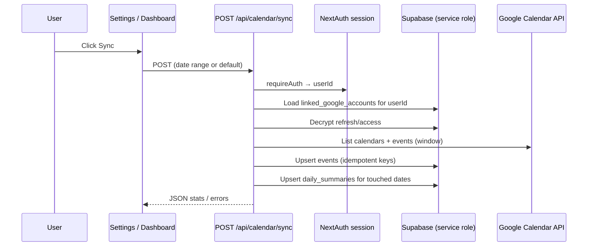

# Web calendar sync → Supabase — design spec

**Date:** 2026-03-19  
**Status:** Draft for review  
**Decision:** **Option C** — v1 is **explicit user-triggered sync** (“Sync now” / connect flow), with storage and APIs shaped so we can add **automatic sync on login** or **scheduled jobs** later without redesign. **First slice:** **B** (reuse NextAuth Google tokens).

---

## Product decisions (locked — 2026-03-19)

| Topic | Decision |
|--------|-----------|
| **Which calendars (v1)** | Sync **all** calendars returned by Google Calendar **`calendarList.list`** for the linked account (typically “selected” / visible calendars; confirm in implementation against API defaults). **No** per-calendar picker in v1. |
| **Calendar include/exclude (later)** | **Future:** user setting to **disable** specific calendars for **sync and/or dashboard math** (persisted, changeable over time) — e.g. `user_preferences` JSON or dedicated table; **out of scope for v1** beyond noting hooks in sync engine (`shouldIncludeCalendar(calendarId)`). |
| **Default sync window** | **30 days in the past → 30 days in the future** (60-day span). Implementation may use **multiple `events.list` calls** (pagination via `pageToken`, and/or chunking by time range) to stay within quotas/timeouts. |
| **Events gone from Google** | **Mark as removed** (retain row for history/audit). *Note:* SQLite today **`markEventRemoved`** writes an audit row then **DELETE**s from `events`; Postgres has no `event_changes` table in `001`. **Implementation choice:** add **`removed_at TIMESTAMPTZ NULL`** (or `sync_status`) on **`public.events`** + filter `removed_at IS NULL` in reads **or** hard-delete to match SQLite only — **recommend soft column** to match your “mark removed” wording. |
| **Colors / categories** | Reuse the same mapping / auto-categorization as the **SQLite sync path** (`COLOR_DEFINITIONS`, `suggestCategory` / `calendar-manager` behavior ported or shared). |

---

## UTC, `DATE`, and `TIMESTAMPTZ` (storage vs UI)

**Mostly right, with one nuance:**

- **`start_time` / `end_time`** (`TIMESTAMPTZ` in Postgres): Stored as **absolute instants**; PostgreSQL keeps them in **UTC** internally. Clients and drivers typically send/receive ISO-8601 with offset or Z. **Rendering** should convert to the user’s display timezone (or a fixed app convention) in the UI/API response formatting layer.
- **`events.date`** (`DATE`): A **calendar date with no timezone** in the database—it is not “stored in UTC” the way a timestamp is. In practice we should **derive `date` with one explicit rule** from the event’s instant (e.g. **UTC calendar date of `start_time`**, or “local date in timezone X”) and **document that rule** so sync, summaries, and queries stay consistent. Display can still show “Tuesday” in the user locale by combining `start_time` + tz.
- **Summary:** Treat **timestamps as UTC instants**; treat **`date` as a denormalized bucket** derived under a fixed rule; **format for humans when rendering**, not by storing ambiguous local strings in the DB.

---

## Google OAuth scopes (NextAuth `Google()` vs Calendar API)

There is **no “five scopes”** requirement—the earlier spec item **5** was the fifth *bullet* in a list, not “request five scopes.”

**What’s going on:**

- NextAuth’s **Google** provider, by default, drives **OpenID Connect sign-in** (`openid`, `profile`, `email`). That lets MeOS **identify the user** and get tokens, but it does **not** automatically include **Google Calendar API** access.
- To call **Calendar API** (`events.list`, `calendarList.list`, etc.), the OAuth consent must include a **Calendar scope**, e.g.  
  **`https://www.googleapis.com/auth/calendar.readonly`** — read calendars and events only.
- If the webapp must **change** events in Google (e.g. color updates via existing APIs), you may need a **broader** scope such as **`https://www.googleapis.com/auth/calendar`** (read/write). That is a **stricter** consent than `calendar.readonly`.

**Implementation direction:** Set `authorization.params.scope` on the `Google({...})` provider to **OIDC scopes + the Calendar scope(s) you need** (space-separated), e.g.  
`openid email profile https://www.googleapis.com/auth/calendar.readonly`  
or include full `calendar` if writes are required. **Google Cloud Console** OAuth client must allow those scopes; users re-consent when scopes change.

---

## 1. Problem

- The dashboard reads **`events`** and **`daily_summaries`** via `/api/summaries`, `/api/events`, `/api/calendars` (`webapp/lib/db-supabase.ts`).
- **NextAuth + Google** only establishes identity in **`next_auth`**; it does **not** populate calendar rows.
- **`linked_google_accounts`** exists (encrypted tokens, per-user Google identities) but has **no working write path** from the web app; Settings still shows “Coming Soon”.
- **`lib/calendar-sync.ts`** + **`scripts/sync-calendar.ts`** target **SQLite** (`calendar-db`), not Supabase — not reusable as-is for the webapp.

---

## 2. Goals (v1)

1. After the user completes an explicit action, **fetch Google Calendar events** for a configurable window and **upsert** into **`public.events`** for that MeOS user.
2. **Recompute or upsert** **`daily_summaries`** for affected dates so the existing dashboard stays correct without ad-hoc client logic.
3. **Persist OAuth tokens** in **`linked_google_accounts`** (encrypted), scoped by **NextAuth `user.id`** (UUID from `next_auth.users`).
4. **Design for extension:** a single internal “run sync for `userId` + `linkedAccountId` + date range” function callable from **POST /api/...** today and from a **cron** or **signIn event** tomorrow.

Non-goals (v1): background queue service, multi-region, incremental Google push notifications (webhooks), full parity with every CLI flag.

---

## 3. Approaches considered

### A. Duplicate OAuth: separate “Connect Google” OAuth (disabled NextAuth token use)

- **Pros:** Clear separation; can request narrow scopes on connect.
- **Cons:** Two Google consents, confusing UX, more moving parts.

### B. Capture tokens from existing NextAuth Google sign-in

- **Pros:** One consent (already `access_type: offline` + `prompt: consent` in `webapp/lib/auth.ts`); refresh token available on **first** consent; minimal new OAuth surface.
- **Cons:** Must hook **`events` or `signIn` callback** (or a one-time migration path) to encrypt and upsert **`linked_google_accounts`**; token rotation must update DB.

### C. Hybrid (recommended for v1)

- **Primary:** **B** — persist Google **`Account`** tokens into **`linked_google_accounts`** when present (see §5).
- **Fallback / multi-account later:** **A**-style “Link another Google account” using the same **web** OAuth client and a dedicated callback route (already hinted in Settings UI).

**Recommendation:** **C** implemented incrementally: ship **B + manual sync** first; add second-account linking when needed.

---

## 4. Architecture (v1)

### 4.1 Modules (suggested boundaries)

| Unit | Responsibility |
|------|------------------|
| **`lib/token-crypto.ts`** (or extend existing) | AES-256-GCM encrypt/decrypt using **`TOKEN_ENCRYPTION_KEY`**; constant-time compare avoided not required here. |
| **`lib/linked-google.ts`** | CRUD for **`linked_google_accounts`** via existing Supabase server client; map NextAuth account → row shape. |
| **`lib/calendar-sync-supabase.ts`** | **Pure sync engine:** input `(userId, linkedRow, start, end)` → Google fetch → normalize to `events` rows → upsert → rebuild summaries. No HTTP. |
| **`app/api/calendar/sync/route.ts`** | Auth, validation, load links, call engine, return result. |
| **NextAuth `events.signIn` or `callbacks.jwt`** | When `account.refresh_token` (or access) exists, **upsert** primary linked row (v1: single Google account per user acceptable). |

### 4.2 Idempotency & keys

- **`events.id`:** stable string per user + Google event instance, e.g. `${userId}:${googleEventId}:${start_time}` or reuse CLI convention if documented in `calendar-db` / migrate script — **must match** any existing import tooling.
- **`google_event_id`:** store Google’s event `id`; handle recurring instances (instance id vs master) same as SQLite sync where possible.
- **Upsert strategy:** `onConflict` on primary key or delete+insert for window (prefer upsert to avoid flicker).

### 4.3 Summaries

- After event upsert for date range **`[start, end]`**, recompute **`daily_summaries`** for those dates (reuse logic from **`computeSummariesFromEvents`** / port from **`lib/calendar-sync.ts`** + `generateDailySummary` behavior).
- Keep **analysis hour defaults** consistent with `/api/summaries` (9–17 unless user prefs later).

### 4.4 API contract (v1)

- **`POST /api/calendar/sync`**
  - Body (optional): `{ "start": "YYYY-MM-DD", "end": "YYYY-MM-DD", "linkedAccountId": "..." }`
  - **Default window:** **today − 30 days** through **today + 30 days** (inclusive of boundaries per implementation).
  - Response: `{ ok, stats: { fetched, upserted, markedRemoved, summariesUpdated }, errors?: [...] }`
- **Auth:** `requireAuth()`; **never** accept `userId` from client.

### 4.5 UI (minimal v1)

- Enable **“Sync calendar”** on Settings → Linked Accounts (or dashboard empty-state) calling the POST route; show progress + last sync time (optional: new `user_preferences` key `last_calendar_sync_at`).

---

## 5. Token persistence (NextAuth → Supabase)

- On **`signIn`** with Google, when `account.refresh_token` is present, encrypt **access_token**, **refresh_token**, set **scopes**, **token_expiry**, resolve **google_email** (Calendar **`calendarList.get("primary")`** or `profile.email` if trusted).
- **`account_label`:** v1 default **`"primary"`** or derived from email domain; user-renamable later.
- If **`refresh_token` missing** (Google only sends on first consent), UI copy: “Remove app access in Google Account settings and sign in again” or dedicated **re-auth** link — already common pattern.

---

## 6. Security

- **Server-only:** sync route and crypto; no tokens in browser beyond session cookie.
- **`TOKEN_ENCRYPTION_KEY`** required in production for token columns (already in `.env.example`).
- **Scopes:** extend NextAuth **`Google()`** `authorization.params.scope` to include **Calendar API** (see **Google OAuth scopes** section above); use **`calendar.readonly`** if sync is read-only, or **`calendar`** if the product mutates Google events.
- **Service role:** existing pattern — server enforces `userId` from session on every query.

---

## 7. Prerequisite: `user_id` foreign keys vs NextAuth

`001_initial_schema.sql` defines **`user_id … REFERENCES auth.users(id)`** for **`events`**, **`linked_google_accounts`**, etc. The running app uses **NextAuth** users in **`next_auth.users`**, not Supabase Auth.

- **Symptom:** Inserts may **fail FK checks** if the NextAuth UUID is not present in **`auth.users`**.
- **Recommended fix (before or with sync PR):** migration to **`ALTER` foreign keys** on tenant tables to reference **`next_auth.users(id)`** (or drop FK and enforce in app — weaker). Align **`auth.uid()` RLS** story separately if you ever move off service role for user-scoped REST.

This item is **blocking** for reliable sync writes; confirm on a dev branch with a test insert.

---

## 8. Future hooks (post-v1)

- **Auto-sync on signIn:** call same engine with short cooldown (store `last_calendar_sync_at`).
- **Cron:** Vercel cron / external worker with **service role + explicit user list** or per-user scheduled jobs.
- **Multi-account:** second OAuth flow writing additional **`linked_google_accounts`** rows; sync iterates all links.
- **Per-calendar toggles:** persisted exclude list; sync skips those calendars; dashboard/summary queries optionally exclude the same set.

---

## 9. Testing

- **Unit:** token crypto round-trip; event id stability; summary math for fixture events.
- **Integration:** mock Google API or recorded fixtures; assert Supabase upserts with test `userId`.
- **Manual:** Settings → Sync → dashboard populated; re-run idempotent.

---

## 10. Implementation decisions (locked)

1. **`events.id` —** **Supabase-first:** define one **stable string key** for upserts (document the format in code). **Do not** optimize around Turso/SQLite or CLI imports long-term; deprecate/remove Turso-centric assumptions in new code paths.
2. **`date` / time —** **UTC discipline:** `TIMESTAMPTZ` fields are UTC instants; derive **`date`** under a **single documented rule** (see **UTC, `DATE`, and `TIMESTAMPTZ`** above). **Format for display** in the UI (and in API responses if we emit localized strings).
3. **Recurring / instance IDs —** Same behavior as existing **`calendar-sync` / `time-analysis`** (no new rules).
4. **Concurrent sync —** **Debounce** and/or **in-progress guard** so overlapping syncs cannot run (double-click, two tabs).
5. **Google scopes —** Add explicit **Calendar** scope(s) on NextAuth **`Google()`**; use **`calendar.readonly`** unless write features require full **`calendar`** (see **Google OAuth scopes** section).
6. **Removed events —** **Soft remove:** **`removed_at TIMESTAMPTZ NULL`** on **`events`**; exclude by default in reads/summaries; optional “show removed” later.
7. **Errors —** **Fail per calendar**, not whole sync: return partial success + per-calendar errors in the API response.

---

## Approval

- [ ] User reviewed and approved this spec (or noted edits).
- [ ] Then: create implementation plan in `docs/superpowers/plans/` (see `.claude/workflows/planning.md`) and execute in small PRs: **FK migration → token capture → sync engine → API → UI**.
